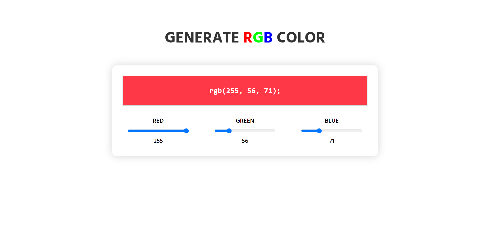
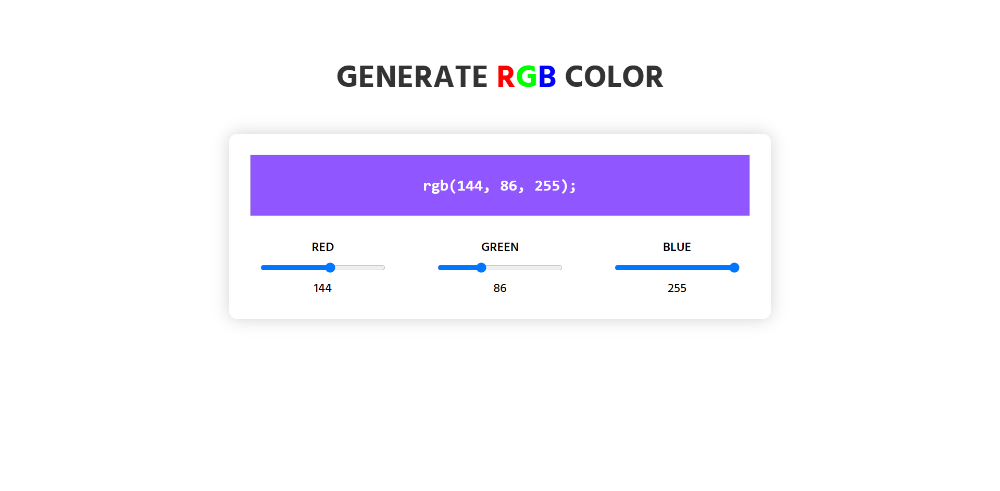
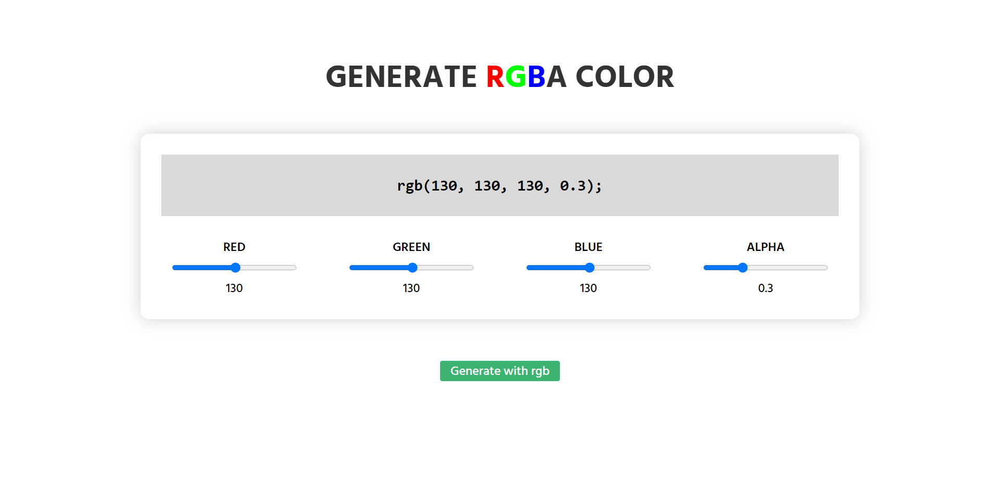
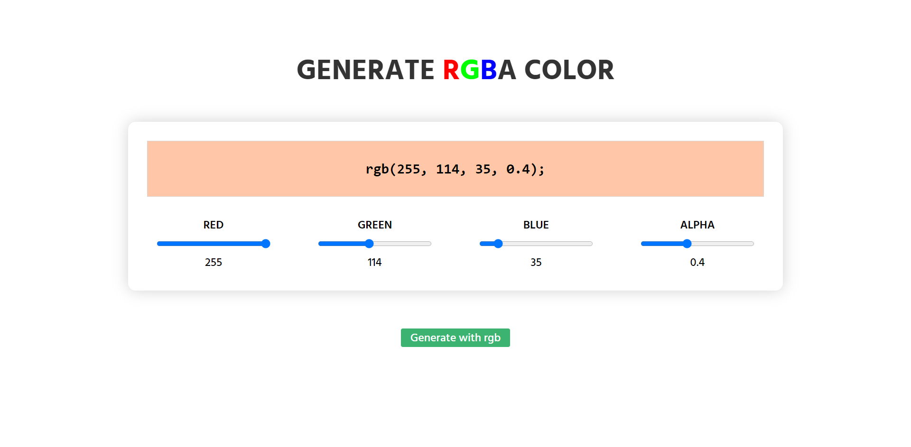

# Generate RGB Color.

An RGB color value represents RED, GREEN, and BLUE light sources.

## RGB Value

In CSS, a color can be specified as an RGB value, using this formula:

**`rgb(red, green, blue)`**

Each parameter (red, green, and blue) defines the intensity of the color between 0 and 255.

For example, `rgb(255, 0, 0)` is displayed as red, because red is set to its highest value (255) and the others are set to 0.

To display black, set all color parameters to 0, like this: `rgb(0, 0, 0)`.

To display white, set all color parameters to 255, like this: `rgb(255, 255, 255)`.

Experiment by mixing the RGB values [here](https://nazmulhossain2905.github.io/generate-rgb-color/).

---

## [Visit - Live Site](https://nazmulhossain2905.github.io/generate-rgb-color/)

## Screenshots

---

---

### RGBA Color - rgba(red, green, blue, alpha)

---

### Using Languages

- HTML
- CSS
- JavaScript

---

You can follow me. 👍🏻👍🏻

### Thank You. ♥️♥️
